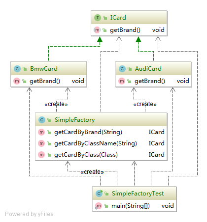
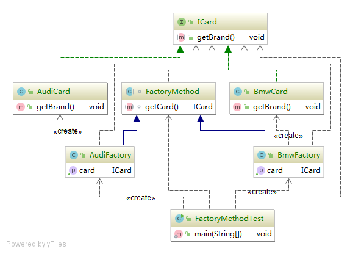
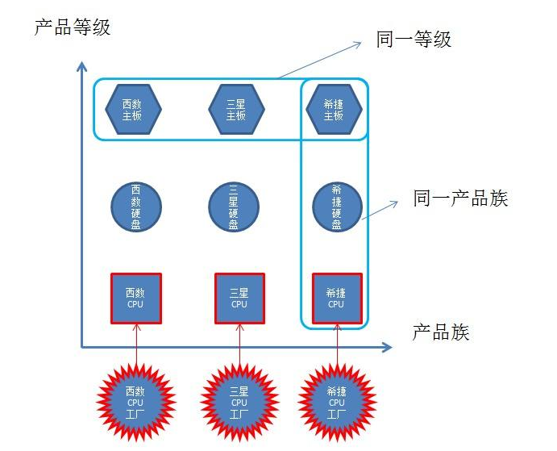
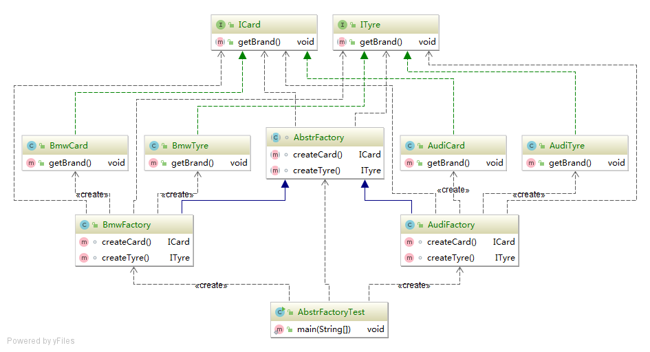

# 设计模式
## 工厂模式
### 简单工厂
####
汽车工厂，有一个条流水线制造汽车。汽车工厂业务扩展了，需要制造更多类型的汽车，就需要增加修改流水线里面各岗位,职责太重，维护成功较大。(需要升级)
##### 优点：
 - 只需传入一个正确的参数，就可以获取想要的对象，无需要关系创建细节;
 #### 缺点：
 - 扩展产品时，需要修改工厂方法,违背开闭原则。
 - 扩展产品时，工厂创建产品类型较多，职责过重，违背单一原则；
 #### UML

### 工厂方法
汽车工厂业务扩展了，需要制造更多类型的汽车，工厂升级为集团，开设子工厂，每个子工厂制造一种类型的汽车。
#### 优点：
  - 用户只需要关心新产品对应的工厂，无须关心创建细节;
  - 一个工厂只做一件事，符合单一原则；
  - 扩展新产品只需要新增对应产品工厂，可扩展性高，符合开闭原则;
#### 缺点：
 - 工厂类较多，增加代码结构复杂度；
  - 增加了系统抽象性，理解难度增加；  
#### UML
`可以是接口，也可以是抽象类。抽象类可以方便扩展，多继承单实现机制`

### 抽象工厂
汽车集团业务扩展了，除了需要制造更多类型的汽车，还要制造轮胎等业务，每个子工厂制造一种类型的汽车，还需要制造对应的轮胎等产品。`需要了解产品族和产品等级关系`

#### 优点：
- 顶级工厂定义所有工厂方法，扩展性强
#### 缺点：
- 工厂类较多，增加代码结构复杂度；
-增加了系统抽象性，理解难度增加；
- 工厂新增产品时，需要修改顶级类，影响大，违背开闭原则；
#### UML

