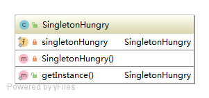
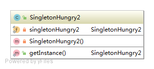
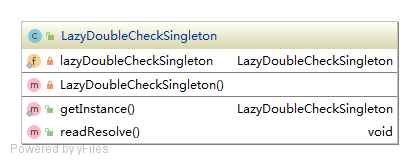
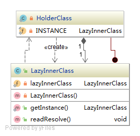
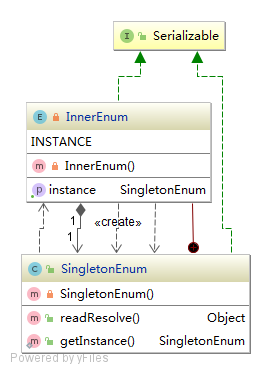

# 设计模式—单例模式
单例模式(Singleton Pattern)是指一个类在何情况下，都保证JVM中有且只有一个单实例，并提供一个全局访问点。  
`单例模式是创建弄模式`  
## 饿汉式单例
饿汉式的单例是指当类加载的时候立即初始化并创建实例；线程安全。
### 优点：
- 线程安全
- 执行效率高
### 缺点：
- 无论该单例类是否使用都会创建实例，浪费JVM内在空间

### 饿汉式单例两种写法
- 方式一
```java
public class SingletonHungry {

    private final static SingletonHungry singletonHungry = new SingletonHungry();

    private SingletonHungry(){}

    public static SingletonHungry getInstance(){
        return singletonHungry;
    }
}
```
#### UML

- 方式二
```java
public class SingletonHungry2 {

    private final static SingletonHungry2 singletonHungry2;

    static{
        singletonHungry2 = new SingletonHungry2();
    }

    private SingletonHungry2(){}

    public static SingletonHungry2 getInstance(){
        return singletonHungry2;
    }
}
```
#### UML

## 懒汉式单例
懒汉式的单例是指当类加载的时候，类并没有初始化，当外部内调用到的时候才会初始化并创建实例；线程不安全，需要考虑多线程并发问题。  
### 优点：
- 外部调用时才会初始化并创建实例，不浪费JVM空间
### 缺点：
- 执行效率相比饿汉式较慢
- 存在线程安全问题
- 反射可破坏单例
- 反序例化可破坏单例

### 懒汉式单例两种写法
- 方式一
```java
public class LazyDoubleCheckSingleton {

    private static LazyDoubleCheckSingleton lazyDoubleCheckSingleton;

    private LazyDoubleCheckSingleton() {
        if(lazyDoubleCheckSingleton != null){//防反射破坏单例
            throw new RuntimeException("实例已存在");
        }
    }

    public static LazyDoubleCheckSingleton getInstance() {
        if (lazyDoubleCheckSingleton == null) {
            synchronized (LazyDoubleCheckSingleton.class) {
                if (lazyDoubleCheckSingleton == null) {
                    lazyDoubleCheckSingleton = new LazyDoubleCheckSingleton();
                }
            }
        }
        return lazyDoubleCheckSingleton;
    }

    public void readResolve(){//防序例化破坏单例
        if (lazyDoubleCheckSingleton == null) {
            synchronized (LazyDoubleCheckSingleton.class) {
                if (lazyDoubleCheckSingleton == null) {
                    lazyDoubleCheckSingleton = new LazyDoubleCheckSingleton();
                }
            }
        }
    }
}
```
#### UML

- 方式二
```java
public class LazyInnerClass {

    private static LazyInnerClass lazyInnerClass;

    private LazyInnerClass(){//防反射破坏单例
        if(lazyInnerClass != null){
            throw new RuntimeException("实例已存在");
        }
    }

    public static LazyInnerClass getInstance(){
        if(lazyInnerClass == null){
            lazyInnerClass = HolderClass.INSTANCE;
        }
        return lazyInnerClass;
    }

    private static class HolderClass{
        private static final LazyInnerClass INSTANCE = new LazyInnerClass();
    }

    public void readResolve(){//防序例化破坏单例
        if(lazyInnerClass == null){
            lazyInnerClass = HolderClass.INSTANCE;
        }
    }
}
```
#### UML

## 枚举式单例
枚举式的单例属于注册式单例中的一种；是指将每一个实例都登记到某一个地方，使用唯一的标 识获取实例。  
### 优点：
- 线程安全
- 执行效率高
### 缺点：
- 无论该单例类是否使用都会创建实例，浪费JVM内在空间
### 枚举式单例写法
```java
public enum  SingletonEnum {
    INSTANCE;
    private DataSource dataSource;

    public DataSource getInstance(){
        return this.dataSource;
    }

    SingletonEnum(){
        this.dataSource = new DataSource();
    }
}
```
#### UML
